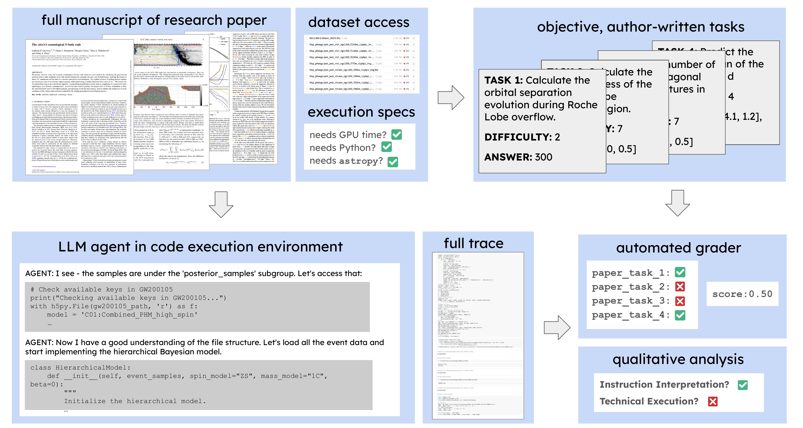

# ReplicationBench: Can AI Agents Replicate Astrophysics Research Papers?

**ResearchBench** is an AI evaluation benchmark that tests whether AI agents can replicate real astrophysics research papers from scratch. The benchmark includes **31 papers** with **174 tasks** that decompose papers into core research contributions including experimental design, mathematical derivations, data analysis, and code implementation.

**Paper**: [ReplicationBench: Can AI Agents Replicate Astrophysics Research Papers?](https://arxiv.org/abs/2510.24591)



## Setup

```bash
git clone https://github.com/Christine8888/researchbench-release.git
cd researchbench-release

# Basic installation -- for dataset loading only
uv pip install -e .

# Install with dependencies for downloading datasets
uv pip install -e ".[download]"

# Install with dependencies for running evaluations
uv pip install -e ".[eval]"

# Install with all dependencies
uv pip install -e ".[all]"
```

## Using the Dataset

### Loading Papers and Tasks
You can use the Dataloader to load papers with their associated tasks.
```python
from dataset.dataloader import Dataloader

# Load all papers from the core ReplicationBench dataset (expert-written tasks)
loader = Dataloader(filters={"source": "expert"})
print(f"Loaded {len(loader.papers)} papers")
for paper_id in loader.papers:
    print(f"  - {paper_id}")
```

### Standard Evaluation Prompts
You can generate standard evaluation prompts for a paper as follows:

```python
from evaluation.core.prompts import get_paper_prompt

paper = loader.papers["gw_cosmo"]
prompt = get_paper_prompt(
    paper=paper,
    workspace="/path/to/workspace/gw_cosmo",  # Optional: workspace path
    include_workspace=True  # Tell agent about pre-downloaded data
)
```

## Environment Setup

You can set up the environment for a paper as follows:

```python
from dataset.dataloader import Dataloader
from evaluation.setup import setup_paper_environment

loader = Dataloader(paper_ids=["gw_cosmo"])
paper = loader.papers["gw_cosmo"]

workspace_dir = "/path/to/workspace/gw_cosmo"
setup_paper_environment(
    paper,
    workspace_dir=workspace_dir,
    download_data=True,
    install_deps=True
)
```

Note that this will install Python dependencies directly using `pip`, so this should be run *inside* the evaluation container.

## Running Evaluations

### Using TerminalBench

ReplicationBench can be run through the TerminalBench framework. Datasets are available in [Harbor format](https://github.com/laude-institute/harbor-datasets/).

### Using Inspect

We also support running evaluations using [Inspect AI](https://inspect.aisi.org.uk). In an image with dependencies and datasets installed, you can run evaluations as follows:

```python
from evaluation.run_single import run_single_evaluation

run_single_evaluation(
    paper_id="gw_cosmo",
    model="anthropic/claude-3-5-sonnet-20241022",
    log_dir="./logs/my_run",
    workspace_base="./workspaces"  # Will use ./workspaces/gw_cosmo
)
```

## Contributing

We welcome contributions of new papers and tasks! If you are a researcher and have a candidate paper you would like to add to the dataset, please contact us with **[this form](https://docs.google.com/forms/d/e/1FAIpQLSe9JcvIFzBD_z1KhOsqNRDhcUBY6seGZRJyRfE_yE4TLPRu5A/viewform?usp=sharing&ouid=101310934872802722547)**. We will reach out with further instructions on how to adapt the paper for the dataset.

We also accept direct PRs for tasks; see **[the PR instructions](PR_INSTRUCTIONS.md)** for detailed instructions on.

## Citation and License

If you use ReplicationBench in your work, please cite:

```bibtex
@misc{ye2025replicationbenchaiagentsreplicate,
      title={ReplicationBench: Can AI Agents Replicate Astrophysics Research Papers?},
      author={Christine Ye and Sihan Yuan and Suchetha Cooray and Steven Dillmann and Ian L. V. Roque and Dalya Baron and Philipp Frank and Sergio Martin-Alvarez and Nolan Koblischke and Frank J Qu and Diyi Yang and Risa Wechsler and Ioana Ciuca},
      year={2025},
      eprint={2510.24591},
      archivePrefix={arXiv},
      primaryClass={cs.CL},
      url={https://arxiv.org/abs/2510.24591},
}
```

## License

ResearchBench is released under the MIT License. See [LICENSE](LICENSE) for details.
